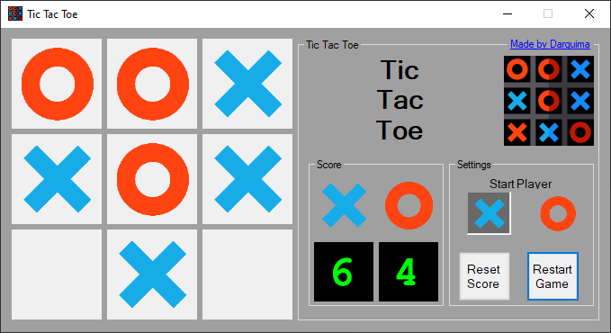

Tic Tac Toe is a project created to study Windows Forms, a subject at my High School. Is a simple Tic Tac Toe Game with a score counter.
Download the game [here](https://github.com/Darguima/Tic-Tac-Toe/releases/tag/v1.0.0).

###### Technologies used: `C#` & `Windows Forms`

